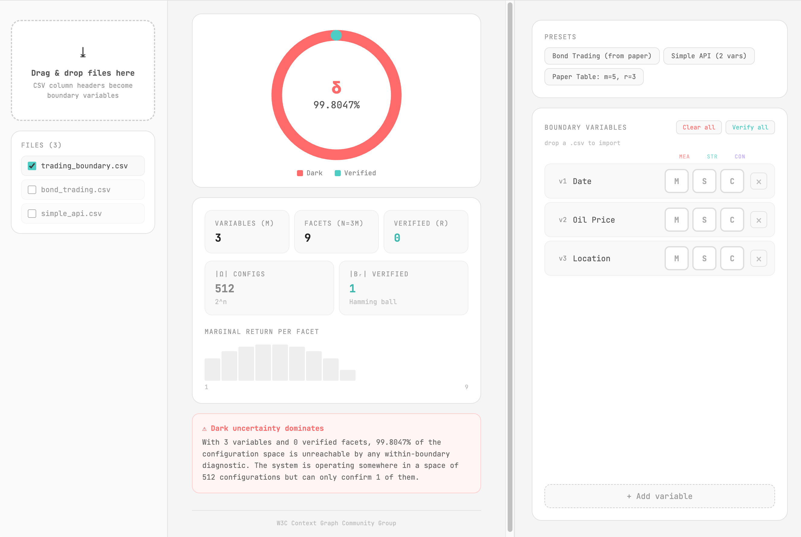

# Context Graph Protocol — Getting Started Guide

When you hand an AI agent "2026-01-15" in a Date field, the agent makes assumptions.

Is this a trade date or a birthday? ISO format or US ordering? What timezone? Is "yesterday" already resolved, or is the agent about to resolve it from its own context?

Those assumptions drive the output. They determine whether the answer is right or wrong. But today they're invisible — and you can't fix what you can't see.

Without a shared coordinate system, you can't even tell there's something to measure. The dark assumptions stay dark because there's no geometry to locate them in.

We call the fraction of assumptions that are operating without being named **Dark Uncertainty**. It is computable, reducible, and — crucially — a prerequisite for anything else.

## Important Information 
Please read the following, it is an important principle to understand.

### IDs, References, and Instances

In CGP, the **URL is the identity**. When one part of the graph refers to another, it holds the target's URL — there are no separate "ID" values distinct from addresses. ID, reference, and address are the same concept, looked at from different directions.

- An **ID** is a URL — the permanent address of a node.
- A **reference** is a URL placed inside another node's facet (for example, a claim's `channel` column holds the URL of an event definition).
- An **instance** is what `/data` returns when the URL is dereferenced — the content at that identity.

These aren't three different things with a mapping between them. They're one thing (the URL) described from three perspectives: *what you write down*, *what you point at*, *what you receive*. The URL is always the same URL; only the direction changes.

This is why the `/data` facet exists: it is the **instance accessor**. Asking "what is at this URL?" is the same as asking "what is this URL's `/data`?" The other three facets (`/meaning`, `/structure`, `/context`) describe how to interpret the instance.

### Examples:

```
cgp:/s/<system>/o/<observatron>/c/<channel-name>/<event-n>/a/<anchor>/p/<path>
```

```
cgp:/s/0
  instance: "0" (or whatever the system is named)

cgp:/s/0/o/1
  instance: "1" (or whatever the observatron is named)

cgp:/s/0/o/1/c/state-change/4
  instance: summary of the 5th state-change event

cgp:/s/0/o/1/c/state-change/4/a/0
  instance: the anchor's payload (e.g., a CSV file's contents)

cgp:/s/0/o/1/c/state-change/4/a/0/p/0
  instance: the column's values (the leaf payload)
```
#### Event Position and Time

The `<event-n>` counter in a URL is the event's **position** in its channel's sequence. The event's **time** is recorded separately — as the first row's timestamp in that event's `/context` facet.

These are two projections of the same event along different axes:

- The URL names **which** event (the 5th state-change).
- The Context log names **when** it happened (ISO 8601 UTC ms).

Position is structural; time is recorded. Clock skew between implementations doesn't affect `<event-n>` — the counter is local and deterministic, so two implementations that both fire three state-change events produce the same URLs regardless of whether their clocks agree. Replaying a claim log on a new system reconstructs URLs identically; only the Context timestamps differ.

This is why URLs don't carry timestamps directly. Position is the URL's job; time is Context's job. Each dimension lives in the place it naturally belongs, and the connection between them is derivable — dereference the URL, read the first Context row, get the time.

## Motivation

### Step 1 — See Dark Uncertainty (The Four Facet Model)

Every addressable unit in any system — a CSV column, a system prompt workflow on the backend, a UX field — gets four facets:

- **Data** — The content wrapped by **Context Graph Protocol Language** (*CGPL*) markup and captured at an interaction event.
- **Meaning** — The semantic domain the data refers to: what it *is about* in the world, not what it *is* on the page.
- **Structure** — The constraints, generators, and validators of a schema (JSON Schema syntax is default).
- **Context** — A time-ordered log of what has happened at this unit. Each row records `timestamp`, `channel`, `key`, `value` — rule firings, asks, resolutions, state changes, all in the same shape.

Same four facets everywhere. That uniformity is the geometry. Once it's in place, the invisible becomes addressable with a URL. Before we can do anything, we need to be able to measure it. Without a shared geometry, there's no shared "perspective lines" to make comparisons at all.

### Step 2 — Score Dark Uncertainty in Real-Time (δ → "Dark Fraction Score")

With shared geometry, we can compute dark fraction:

$$\delta = 1 - \frac{|B_r|}{2^n}$$

<p align="center"><em>δ = 1 − |B<sub>r</sub>| / 2<sup>n</sup></em></p>

Data is part of the Shannon "message" — the communicated information in a transmission event. Its presence is what brings the spike into existence; a spike that isn't attached to the observatron's surface doesn't exist. Each spike is still a full tetrahedron geometrically, with Data as the base anchoring it to the node and Meaning, Structure, and Context rising as the three elevated faces. Uncertainty can only accumulate along those three elevated dimensions.

For a boundary with m variables, the formula operates on n = 3m verifiable facets — three per variable (Meaning, Structure, Context). r is how many of those facets have been verified. |B_r| is the Hamming ball cardinality. 2ⁿ is the joint configuration space.

#### Calculating δ by Hand — The Simplest Case (m=1, n=3)

Before the three-variable example, work through the simplest possible boundary: one column, fully unverified. This walks the formula step by step — the kind of thing you could compute on a napkin.

**Setup.** A CSV drop with one column: `Date`. No facets have been verified yet. So m = 1, n = 3m = 3, r = 0.

**Step 1 — Find the joint configuration space: 2ⁿ.**

With n = 3 verifiable facets, each facet is either verified (1) or not (0). That gives:

| n | 2ⁿ | meaning |
|---|---|---|
| 3 | 8 | 8 possible configurations of (Meaning, Structure, Context) |

The boundary lives somewhere in this space of 8 configurations. δ measures how much of that space is still unreachable.

**Step 2 — Count the Hamming ball |B_r|.**

The Hamming ball of radius r is the set of configurations reachable within r verifications of the fully-verified state. Count it by summing binomial coefficients:

$$|B_r| = \sum_{k=0}^{r} \binom{n}{k}$$

For our case (n=3, r=0), only one term matters:

| k | C(n, k) | meaning |
|---|---|---|
| 0 | C(3, 0) = 1 | one configuration: the fully-verified state itself |

So |B_0| = 1.

**Step 3 — Plug into the formula.**

$$\delta = 1 - \frac{|B_r|}{2^n} = 1 - \frac{1}{8} = 0.875$$

**δ = 87.5%.** A one-column boundary with no facets verified is 87.5% dark.

That matches the Quick Start's claim that dropping a one-column CSV yields δ ≈ 0.875 at drop time.

**Step 4 — Watch it change as you verify.**

Verify one facet — say, Meaning — and r becomes 1. Now:

- |B_1| = C(3,0) + C(3,1) = 1 + 3 = 4
- δ = 1 − 4/8 = 0.5 (50% dark)

Verify Structure too, and r = 2:

- |B_2| = C(3,0) + C(3,1) + C(3,2) = 1 + 3 + 3 = 7
- δ = 1 − 7/8 = 0.125 (12.5% dark)

Verify Context — r = 3, all facets populated:

- |B_3| = 1 + 3 + 3 + 1 = 8
- δ = 1 − 8/8 = 0 (0% dark)

| Facets verified (r) | \|B_r\| | δ = 1 − \|B_r\|/8 | Approximation |
|---|---|---|---|
| 0 | 1 | 1 − 1/8 | 87.5% dark |
| 1 | 4 | 1 − 4/8 | 50% dark |
| 2 | 7 | 1 − 7/8 | 12.5% dark |
| 3 | 8 | 0 | 0% dark |

Three verifications move δ from 87.5% down to 0 in discrete, measurable jumps. No ambiguity. No calibration needed. Verification, count, recompute.

Now scale up: with three columns (m=3), you have n=9 verifiable facets instead of 3, and 2⁹ = 512 configurations instead of 8. The arithmetic gets bigger, but the procedure is identical.

Worked example — *δ = 74.61%*. A CSV drop with three variables: Date, Oil Price, Location. Only Date has been fully verified (all 3 of its facets populated); Oil Price and Location are untouched. So m = 3, n = 9, r = 3. The Hamming ball |B_3| = C(9,0) + C(9,1) + C(9,2) + C(9,3) = 1 + 9 + 36 + 84 = 130. That gives δ = 1 − 130/512 = 0.7461 (74.61%).

**The system is operating somewhere in a space of 512 possible configurations but can only confirm 130 of them. 74.61% of the boundary's interpretation space is unreachable by any within-boundary diagnostic.**

Closing each facet gap is a specific, countable action. Manual reduction becomes a measurable benchmark — the progression table below shows how δ moves as verifications accumulate.

#### Symbol Legend

| Symbol | Name | Description |
|---|---|---|
| `δ` | dark fraction | The computed score. Fraction of the joint configuration space still unresolved. Ranges from 0 (fully verified) to nearly 1 (fully dark). Unitless. |
| `m` | variable count | Number of variables at the boundary — columns in a dataset, fields in a form, slots in a query. |
| `n` | facet count | Total verifiable facets, always **3m**. Three facets per variable: Meaning, Structure, Context. Data anchors the spike but is not verifiable in the score. |
| `r` | verified count | How many of the n facets have been populated with a verification value. Moves from 0 to n as reduction happens. |
| `B_r` | Hamming ball of radius r | The set of configurations reachable within r verifications of the fully-verified state. |
| `\|B_r\|` | cardinality of B_r | Count of configurations in the Hamming ball. Computed as Σ C(n, k) for k = 0..r. |
| `2ⁿ` | joint configuration space (\|Ω\|) | All possible configurations across the n verifiable facets. For m=3, n=9 and 2⁹ = 512. |


#### Facet Population Progression (m=3, n=9)

For a three-variable boundary, δ moves through these values as facets are verified. Open the **Dark Fraction Calculator** and toggle facets to watch this progression live:

| Facets verified (r) | \|B_r\| | δ = 1 − \|B_r\|/512 | Approximation |
|---|---|---|---|
| 0 | 1 | 1 − 1/512 | ~99.8% dark |
| 1 | 10 | 1 − 10/512 | ~98.0% dark |
| 2 | 46 | 1 − 46/512 | ~91.0% dark |
| 3 | 130 | 1 − 130/512 | ~74.6% dark |
| 4 | 256 | 1 − 256/512 | ~50.0% dark |
| 5 | 382 | 1 − 382/512 | ~25.4% dark |
| 6 | 466 | 1 − 466/512 | ~9.0% dark |
| 7 | 502 | 1 − 502/512 | ~2.0% dark |
| 8 | 511 | 1 − 511/512 | ~0.2% dark |
| 9 | 512 | 0 | 0% dark |

Notice the S-curve. The first verifications barely move δ — the unverified space is combinatorially enormous. The middle verifications drop δ sharply. The final verifications finish the collapse. Verification effort pays off most in the middle of the reduction loop.

#### Source of Truth
The Dark Fraction Calculator is the canonical reference implementation of this formula. Any claim in this spec about what δ should be for a given (m, r) pair can be verified by setting up that configuration in the calculator. The calculator handles large-m computation via log-space arithmetic; for m > 20, |Ω| exceeds a million configurations and naive integer math breaks. Implementations should follow the calculator's log-space approach when scaling.


### Step 3 — Minimize Dark Uncertainty with Observatrons

Observatrons can mechanize a specific task: *populate this facet given these inputs*. That's an engineering problem with a definition of done — not a vague "reduce uncertainty" goal. An **observatron** is the unit that performs this work: an autonomous state machine stationed at a boundary, watching what crosses, and resolving facets either deterministically or by asking a human.


In our **Getting Started** example, we will focus on Observatrons across the entire stack — minimal, but end-to-end:

- **UX**: The drag & drop area in HTML
- **API**: Back-end service layer
- **SQL**: Intent mapping to query slots


## What CGP Is
The **Context Graph Protocol** is a syntax that layers over any other syntax — HTML, system prompts, CSV, JSON, SQL, plain text — to bind addressable units across systems to a shared four-facet geometry.

Of the four facets introduced in Step 1, each plays a distinct role:

- **Data** is the Shannon message — the communicated information in a transmission event. It anchors the spike to the observatron's surface.
- **Meaning** and **Structure** describe the message statically — what it refers to and how it's encoded.
- **Context** is different: it's a time-ordered log where external actions leave their trace on the node. If Meaning and Structure describe the message, Context records its collisions with the world. The graph grows by collision.

Because the graph's shape adapts as actions flow through it, we call it Liquid — the protocol's substrate moves between hosts and media without losing identity, taking whichever shape its container demands.

## Try It Yourself — Dark Fraction Calculator

Before diving into code, play with the geometry directly. The **Dark Fraction Calculator** lets you toggle facets on a single field and watch δ change in real time.



<a href="https://w3c-context-graph-community-group.github.io/dark_fraction/calculator/" target="_blank" rel="noopener noreferrer">→ Open the Dark Fraction Calculator</a>

Click **M** to populate Meaning, **S** for Structure, and **C** for Context. Each click closes one facet gap and reduces the dark fraction. Start with everything off and close facets one at a time until you reach δ = 0. That's the full manual reduction loop in about four clicks.

This is the core interaction the protocol enables. Everything in the rest of this guide — wrappers, URL structure, the runtime, the demo — is machinery to surface this same loop across real systems.

## Quick Start

The fastest path from zero to a working CGP observation. Wrap a DOM element, drop a CSV onto it, watch the four-facet graph materialize in real time.

### Install

```bash
npm install cgp-runtime cgp-components
```

### Wrap an element

Import the component once at the top of your page, then wrap any element you want to observe with a `<cgp-drag-and-drop>` tag:

```html
<script type="module">
  import "cgp-components/drag-and-drop";
</script>

<cgp-drag-and-drop system-id="0" observatron-id="1">
  <div class="drop-target">Drop a CSV here</div>
</cgp-drag-and-drop>
```

The tag takes two attributes:
- `system-id` — any URL-safe string; your system's identifier
- `observatron-id` — any URL-safe string; this observatron's identifier within the system

The wrapper is transparent. The inner `<div>` remains the drop target. On page load, the wrapper instantiates an observatron and mints two nodes: `cgp:/s/0` (the system) and `cgp:/s/0/o/1` (the observatron), each with their four facets populated.

### Listen for state changes

Every observation dispatches a `cgp-state-change` CustomEvent. Listen anywhere on the page:

```html
<script>
  document.addEventListener("cgp-state-change", (event) => {
    console.log(event.detail.state);
  });
</script>
```

The `event.detail.state` is a flat object keyed by URL, with each URL's four facets as its value.


## CGP URL Schema

Every CGP URL follows a single positional pattern. Each segment is prefixed by a single letter naming the slot; the value after the letter identifies the instance.

```
cgp:/s/<system>/o/<observatron>/c/<channel-name>/<event-n>/a/<anchor>/p/<path>
```

### Slots

| Slot | Prefix | What it addresses |
|---|---|---|
| system | `s` | Unit of scope. Instantiates observatrons. |
| observatron | `o` | Agent stationed at a boundary. The node. |
| channel + event | `c` | Compound slot. The channel name identifies the kind of event (referencing a definition under `cgp:/root/events/`); the event counter follows, auto-incrementing per channel, per observatron. Written as `c/<channel-name>/<event-n>`. |
| anchor | `a` | One anchor produced by an event — one file, one message, one API payload. The base of a set of spikes. |
| path | `p` | One spike — a column, a field, a JSON Pointer target within the anchor. |

### IDs

**System and observatron IDs are user-supplied** — typically integers, but any URL-safe string works.

**Channel names** come from the reserved registry `cgp:/root/events/`. The segment is the leaf name of that URL (e.g., `state-change`).

**Event, anchor, and path IDs are auto-generated integers starting at 0**, scoped to their parent. Counters reset per parent: each channel numbers its events from `0` within one observatron; each event numbers its anchors from `0`; each anchor numbers its paths from `0`.

### Facets

Every URL has four facets, written as terminal path segments:

```
<url>/data        the instance at this identity
<url>/meaning     what it refers to
<url>/structure   how it is encoded
<url>/context     a time-ordered log of what has happened
```

All four apply at every slot depth. `cgp:/s/0/data` is valid. So is `cgp:/s/0/o/1/c/state-change/4/a/0/p/0/data`.

Every `/context` facet is a four-column table — `timestamp`, `channel`, `key`, `value` — where rows accumulate in append-only order. Context is the collision surface: where actions, events, and timestamped interactions leave their trace on a node.

### Truncation

Any prefix of the slot pattern is a node. Each has its own four facets.

```
cgp:/s/0                                       the system
cgp:/s/0/o/1                                   an observatron
cgp:/s/0/o/1/c/state-change/4                  an event in a channel
cgp:/s/0/o/1/c/state-change/4/a/0              an anchor
cgp:/s/0/o/1/c/state-change/4/a/0/p/0          a spike (path)
```

### Reserved

The system id `root` is reserved for the protocol's own self-description. All other IDs — including `0`, `1`, `2`, … — are available to user systems.

Reserved namespaces under `cgp:/root`:

| Segment | Purpose |
|---|---|
| `cgp:/root/events` | Registry of channel definitions. Each channel lives at `cgp:/root/events/<source>/<name>` with the standard four facets. The leaf name is what appears as `<channel-name>` in observation URLs. |
| `cgp:/root/claims` | Reserved for future claim log storage. |

## The Canonical Claim Form

A **claim** is a single assertion: at a specific time, a specific node said something about something. Claims are how CGP graphs are exchanged between systems and how the graph's history is made portable.

Claims are a **view** over the URL-addressed facet store — projected when needed, not stored as the authoritative form. A running implementation reads and writes facets directly; claims are generated for export, comparison, and audit.

### The Five Columns

Every claim has exactly five columns. Each is either a URL (acting as ID, reference, and address simultaneously — see "IDs, References, and Instances" above) or a literal.

| Column | Holds | Example |
|---|---|---|
| `channel` | URL of the channel definition — the kind of claim. | `cgp:/root/events/observatron/state-change` |
| `source` | URL of the node that produced the claim. | `cgp:/s/0/o/1/c/state-change/4` |
| `timestamp` | When the claim was made. ISO 8601 UTC, millisecond precision. | `2026-04-22T22:30:00.003Z` |
| `key` | Path within the facet being asserted about. | `/properties.event.type` |
| `value` | The asserted value. A literal or a URL. | `"trade execution date"` |

Read a claim left-to-right as a sentence: *at `timestamp`, `source` asserted that the facet at `key` has `value`, as a claim of kind `channel`*.

### Identity Is Positional

When claims are stored as an ordered array, the position in the array is the claim's identity. No `id` column is needed — index N is claim N.

Individual claims become URL-addressable when they need to be referenced: claim N in a channel's log is addressable under `cgp:/s/<s>/o/<o>/c/<channel>/<event-n>`. The URL is constructed on demand from the log's location and the claim's position; it does not live inside the claim itself.

## Structural Compression

CGP gets most of its efficiency from a single design move applied repeatedly: **if a fact is already carried by the structure, the data does not restate it.** Each time the protocol finds a place where structure can carry a fact "for free," a variable disappears from the data without any loss of information.

Three compressions are load-bearing in the protocol, and each reveals the same pattern at a different level.

### Compression 1 — Array Index Doubles as Event Counter

An append-only array's positional index (0, 1, 2, ...) and the URL's `<event-n>` counter are the same integer doing two jobs. Storing both would mean writing the value twice and risking divergence.

The protocol collapses them: **the array index IS the event-n**. One integer does three jobs — array position, event identity, temporal ordering within the channel. See "Identity Is Positional" in the Canonical Claim Form section for how this plays out in practice.

### Compression 2 — URL is Both Location and Instance

Traditional data models separate addresses from content — you have a pointer, you dereference it, you get the value. CGP collapses this: ID, reference, and instance are one concept viewed from three directions (see "IDs, References, and Instances" at the top of this guide).

The consequence: claims can hold URLs in their `channel` and `source` columns without annotating them as references. In CGP, any URL-shaped value *is* a reference — URLs are the only way to address things, and addresses and values are the same structure.

### Compression 3 — Anchor as Geometric Tetrahedron Base

Each spike is a tetrahedron geometrically: a base (Data) pressed flat against the observatron's surface, with three elevated faces (Meaning, Structure, Context) rising above it.

The base isn't just a face — it's the **attachment point**. It's what binds the spike to the node. A tetrahedron without its base isn't a tetrahedron; it's three floating triangles.

This geometric role corresponds exactly to the role `/data` plays in the protocol. `/data` is:

- The Shannon message — the transmitted content.
- The anchor — what attaches this spike to the observatron.
- The instance — what the URL returns when dereferenced.
- The comparison target — what claims assert values against.

One facet doing four jobs. The geometry and the protocol agree: the base of the tetrahedron is where transmission, attachment, identity, and comparison all converge.

### What This Compression Buys: Comparable Claims

When all three compressions are in place, a claim becomes a tuple that reads naturally as physics:

**(TIME, CHANNEL, SOURCE, KEY, VALUE)**

- **TIME**: when the transmission happened (Context timestamp, or the ordinal event-n if you only need ordering)
- **CHANNEL**: what kind of transmission it was (URL of the event definition)
- **SOURCE**: who transmitted it (URL of the emitting node)
- **KEY**: where in the payload (path within the facet)
- **VALUE**: what was asserted at that position

All five are addressable, all five compose into claims, all five can be compared across observatrons, systems, and time. Because the URL structure carries the first three (CHANNEL, SOURCE, and — via event-n — TIME ordering), only KEY and VALUE live in the claim's row; the rest are derivable from the URL the claim lives at.

The compression isn't a performance optimization. It's the mechanism by which **two independent systems can compare what they saw without sharing any prior schema**. Each system produces URLs that carry their own context. A reader of either system's graph can walk URLs alone to reconstruct most of the picture, dereference `/context` for time, dereference `/data` for values, and compare projections. No lookup table, no translation layer, no schema negotiation.

That's the payoff. Three compressions in the structure, and the output is a protocol where comparability is structural rather than agreed-upon.
